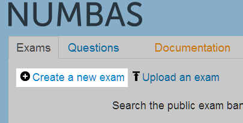
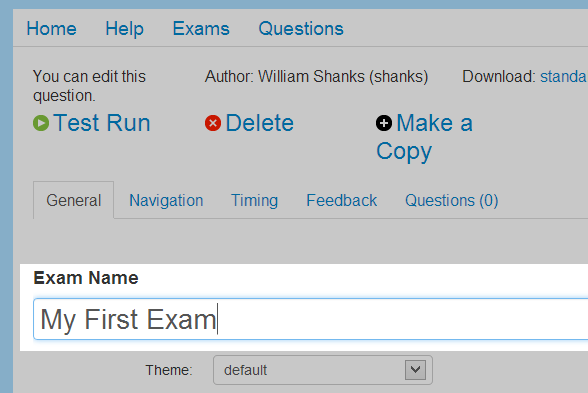
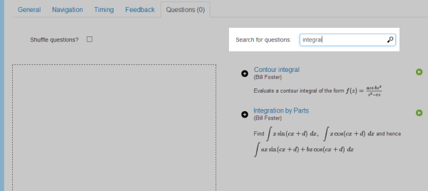
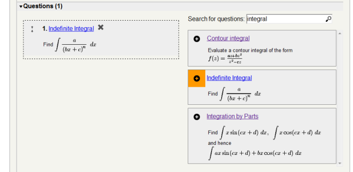
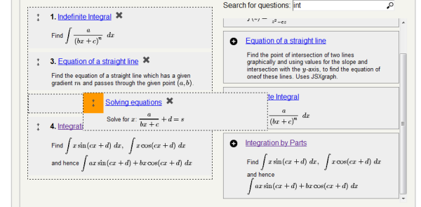
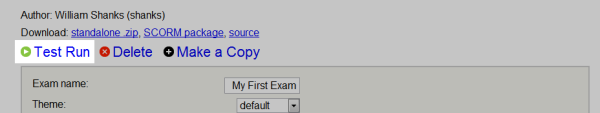

.. _create-exam

Create an exam
--------------

Now you can create your own questions and exams, as well as look at and make copies of those made by others.

First, let's create an exam using questions already in the database. Click on the :guilabel:`Exams` link at the top of the page to go to the list of all exams in the database.

Click on the :guilabel:`Create a new exam` link. You will be taken to the editing page for your new exam. 

Enter a name in the text box. For now, you can ignore most of the options and just select some questions to use. 

Click on the tab labelled :guilabel:`Questions` to go to the question selection area. On the left is space for your selected questions, and on the right is a search box. Type ``integral`` in the search box, and all questions whose names or tags contain the word 'integral' are displayed below. 

You can click on any question's name to open it in a new window, so you can check the question does what you want and give it a test run before including it in your exam.

Click the plus icon on one of the question results to add it to your exam. 

Search for some other terms and add more questions to your exam. You can drag and drop questions in the list on the left to reorder them.

When you've picked some questions, click the :guilabel:`Test Run` link at the top of the page. The compiled exam will open in a new window and you can have a go at answering the questions.

The last thing to do is to give your exam a description. The description should be short -- one or two lines -- and will appear underneath the exam's name in the exam listing page. Click on the :guilabel:`General` tab, and enter your description in the box.
