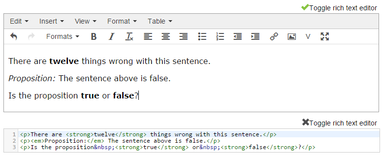

Question editor
***************

Every Numbas question consists of three sections: :ref:`Statement <statement>`, :ref:`Parts <question-parts>`, and :ref:`Advice <advice>`. In the Statement, the context for the question is given to the student. Parts are where the student enters their answers. A question can have one or more parts, each of which is one of several types, depending on what kind of input you want from the student. Finally, the optional Advice section can be used to give a full solution to the question, which the student can request to see if they're stuck.

This page is a reference for each part of the Numbas question editor.

Undo/Redo
=========

You can undo or redo changes made since you opened the question editing page by clicking on the arrows at the top-right of the page.

Content areas
=============

Each portion of text displayed to the student (for example, the statement and question prompts) is a *content area*, and is edited using the rich text editor. Click on the :guilabel:`Toggle rich text editor` button to edit the raw HTML code for the content area.

    The rich text editor, and the raw HTML editor.

You can write mathematical notation in content areas using LaTeX; see the page on :ref:`LaTeX notation`.

You're not limited to just text in content areas - you can insert tables, images, and even more dynamic content such as videos and interactive diagrams. 

Substituting variables into content areas
^^^^^^^^^^^^^^^^^^^^^^^^^^^^^^^^^^^^^^^^^

There are two modes of variable subsitution: substitution into plain text (or HTML), and substitution into mathematical expressions. 

Substitution of variables into plain text is straightforward - just enclose the variable name (or any :ref:`JME` expression) in curly braces. For example::

    Bob the farmer has {num_animals} {animal_name}.

produces::

    Bob the farmer has 12 sheep.

when ``num_animals = 12`` and ``animal_name = "sheep"``.

The substitution of variables into a mathematical expression is more complicated - depending on context, the surrounding expression may need to be change for different values of the substituted variables. See the page on :ref:`simplification-rules`.

Admin buttons
=============

.. glossary::

    Test Run
        Opens a preview of the question in a new window. A specially simplified theme will be used, different from the one used for exams.

        .. warning:: 
            Do **NOT** use this link to deliver the question to students. It will put considerable load on the server. 
            Instead, download the question and put it either on your own webspace or in a VLE.

    Feedback
        Use this button to give feedback about the quality of an question, after test running it. The options are listed in descending order of "suitability for use":

        * **This is ready to use** - this question is of sufficient quality to give to students.
        * **This should not be used** - this question works, but you deprecate its use - for questionple, if it's not intended for use by students, or there's a better version elsewhere.
        * **This has some problems** - this question works, but has some problems which mean it's not ready for use by students - for questionple, the question is incomplete, or changes need to be made to the text. Further work is needed before this question can be given to students.
        * **This doesn't work** - this question doesn't even run!

    Delete
        Delete the question permanently from the database.

    Make a Copy
        Create a copy of the question and edit that instead. Use this to make changes to a question which does not belong to you.

    Download
        Links to download standalone packages of the question. 

        * **standalone .zip** - a compiled package of the question, ready to run anywhere without connecting to a VLE. 
        * **SCORM package** - a compiled package of the question with SCORM files included, so it can be uploaded to a VLE and communicate with its gradebook.
        * **source** - a plain-text representation of the question, to be used with the Numbas command-line tools.

General
========

.. glossary::
    Question name
        The name of the question. This is shown to the student and used for searching within the editor, so make it something intelligible.

    Licence
        You can specify the licence under which you are making your resources available. Different licences allow other users to copy, modify or reuse your content in differnet ways - consider which licence to choose carefully. *CC BY* allows other users to reuse your content however you like, as long as they give appropriate credit to you.

    Description
        Use this field to describe the question's contents, what it assesses, and so on. This is shown in the questions index and in the questions list of any exams containing this question, so make sure it's fairly concise.

    Author's Notes
        Use this field to record notes for yourself or other authors about the design of the question.

    Extensions
        Extensions can provide new functionality, such as extra JME functions or content types. To use an extension, tick its checkbox here. See :doc:`extensions`.

    Tags
        Use tags to categorise questions so they can be found through the search function. Your guiding principle should be "more is better" - try to write down all words that someone searching for this question might use.

        After typing a tag in the box, press the Enter key to add it to the list. You can click on an existing tag to edit or remove it.

.. _statement:

Statement
=========

The statement is a content area which appears at the top of the question, before any input boxes. Use the statement to set the question and provide any information the student needs to answer it.

Variables
=========

The :guilabel:`Computed value` column shows a generated value for each variable. Note that when the question is delivered to students, the variable values are generated with each new attempt, so students won't necessarily see the same values as those displayed here. It's a good idea to use the :guilabel:`Regenerate values` button a few times to check that randomised variables don't take unsuitable values.

You can reorder the variables in the list by dragging the arrow icons. Doing this doesn't affect the way values are computed.

This screencast gives a quick summary of how the variable editing interface works:

.. raw:: html
    
    
<iframe src="http://player.vimeo.com/video/59575797" width="600" height="337" frameborder="0" webkitAllowFullScreen mozallowfullscreen allowFullScreen></iframe>

This screencast describes which variable names are valid, and gives some advice on how you should pick names:

.. raw:: html
    
    
<iframe src="http://player.vimeo.com/video/59577617" width="600" height="337" frameborder="0" webkitAllowFullScreen mozallowfullscreen allowFullScreen></iframe>

Definition
----------

.. glossary::
    Name
        The name of the variable. See the :ref:`section on variable names <variable-names>`.

    Data type
        Specify what type of data the variable should hold. `JME code` allows you to define the variable using :doc:`jme-reference` syntax, while the other options provide simplified forms.

    Value
        Define the variable's value. This depends on the data type.

    Description
        Describe what the variable means, and how it is used. It's also often helpful to explain how it's defined, and what changes can be made to it.

    Depends on
        A list of all variables used in this variable's definition. You can click on a variable name to go to its definition.

    Used by
        A list of all variables which use this variable in their definition. You can click on a variable name to go to its definition.

.. _variable-testing:

Testing
-------

The :guilabel:`Testing` tab provides tools to test your variables for desired properties, so you can automatically re-randomise your questions' variables until you get a suitable set of values.

`Example question using variable testing tools <https://numbas.mathcentre.ac.uk/question/6789/variable-testing/>`_.

.. warning::
    While this tool allows you to pick sets of variables that would be hard to generate constructively, it's a random process so you must be aware that there's a chance no suitable set of values will ever be found. Use the :guilabel:`Test condition` button to see how likely this is.

.. glossary::

    Condition to satisfy
        A JME expression which should evaluate to `true` when the set of variables generated has the properties you want. For example, if `a`, `b` and `c` are the coefficients of a quadratic equation and you want it to have real roots, the condition could be `b^2-4*a*c>=0`.

        When the student runs this question, the system will regenerate the set of variables until it finds one which satisfies this condition.

    Test condition
        When you press this button, the editor will generate as many sets of variables as possible within the time given. When it finishes, you'll be presented with statistics including the proportion of runs which produced acceptable sets of values, and the expected number of runs before an acceptable set of values is found.

        If the calculate probability of getting an acceptable set of variables within 1 second is lower than 99%, you should make changes to your variable definitions.

    Maximum number of runs
        The maximum number of times the system should regenerate the set of variables without finding a set which satisfies the condition before giving up. If the system exceeds this number in a compiled exam, the entire exam will fail, so try to avoid it!

.. _rulesets:

Functions & Rulesets
====================

If you need to do something a bit more complicated with variables, or you find yourself repeating the same pattern over and over, you can define a custom function. Custom functions can be used in any JME expression in the question, such as variable definitions or part answers.

.. glossary::
    Name
        The name of the function. Should be a valid JME name - it should start with a letter, and contain only letters and numbers, with no spaces or punctuation.

    Language
        Functions can be defined either with a JME expression or with JavaScript code. In the case of a JME expression, the value returned is the result of evaluating the expression on the function's parameters. You can also refer to the question's variables.

        JavaScript functions should return their result with a ``return`` expression. You don't need to write the ``function(parameters) {}`` part - just write the function body.

    Output type
        The type of the value returned by the function. 

    Parameters
        The parameters given to the function. You can refer to them by name in the function's definition. Make sure you correctly set the types of the parameters. You can define several functions with the same name but different parameter types, if it makes sense to do so.

    .. _rulesets:

JME functions
-------------

Functions defined using JME work similarly to variables - the function's parameters are substituted into the expression, which is then evaluated.

Comments can be added to function definitions in the same way as variable definitions - anything on a line after two forward slashes is interpreted as a comment and not evaluated. For example::

    map(
        log(n),    //take log of n
        n,         //for n in
        1..10      //the range 1 to 10 (inclusive)
    )

JME does not allow for much control over program flow. Most importantly, there are no loops. Some functions can naturally be defined recursively, but note that recursive function calls can be very slow, since recursion isn't optimised.

Here's an example of a function which computes the :math:`n`\ :sup:`th` Fibonacci number recursively::

    //nth fibonacci number
    //f(0) = f(1) = 1
    //f(n+2) = f(n)+f(n+1)
    if(n<=1,
        1,
    //else
        f(n-2)+f(n-1)
    )

Javascript functions
--------------------

Writing a function in Javascript allows you to use all of that language's features, such as loops, anonymous functions and DOM manipulation. Functions defined in Javasript don't need the ``function(parameters) { ... }`` enclosure - that's provided by Numbas - but they do need to return a value.

Numbas provides a large library of functions which you can use. These are accessed from the objects ``Numbas.math`` and ``Numbas.util``. The best way to see what's available is to look at `the Numbas code documentation <http://numbas.github.io/Numbas>`_. `jQuery <http://jquery.com>`_ is also available. 

While the JME system has its own type system for variables, separate from Javascript's, function parameters are unwrapped to native Javascript values on evaluation so you normally don't need to worry about it.

.. topic:: Examples

    .. highlight:: javascript

    This function takes a list of strings and returns an HTML bullet list::
        
        var ol = $('<ol>');  // create list element

        for(var i=0; i<things.length; i++) {
            ol.append($('<li>').html(things[i]));	//append list item to list
        }
          
        return ol;	//return list

    This function creates an HTML5 ``canvas`` element and draws a rectangle with the given dimensions, along with labels::

        var c = document.createElement('canvas');
        $(c).attr('width',w+40).attr('height',h+40);
        var context = c.getContext('2d');

        //fill in rectangle with a light shade
        context.fillStyle = '#eee';
        context.fillRect(5,5,w,h);

        //draw outline
        context.strokeStyle = '#000';
        context.lineWidth = 3;
        context.strokeRect(5,5,w,h);

        //draw labels
        context.fillStyle = '#000';
        context.font = '20px sans-serif';
        var wstring = w+'m';
        var tw = context.measureText(wstring).width;
        context.fillText(wstring,5+(w-tw)/2,5+h+25);

        var hstring = h+'m';
        var hw = context.measureText(hstring).width;
        context.save();
        context.translate(5+w+25,5+(h+hw)/2);
        context.rotate(-Math.PI/2);
        context.fillText(hstring,0,0);

        return c;

    You can see this function in use at https://numbas.mathcentre.ac.uk/question/759/use-canvas-to-draw-a-rectangle/.

    This function formats a number with commas to separate every third digit, i.e. :math:`1,\!000,\!000` instead of :math:`1000000`::

        var parts=n.toString().split(".");
        if(parts[1] && parts[1].length<2) {
          parts[1]+='0';
        }
        return parts[0].replace(/\B(?=(\d{3})+(?!\d))/g, ",") + (parts[1] ? "." + parts[1] : "");

    You can see this function in use at https://numbas.mathcentre.ac.uk/question/396/numerical-reasoning-average-salary/.

Rulesets
--------

A "ruleset" defines a list of named :doc:`simplification rules <simplification>` used to manipulate mathematical expressions.

Preamble
--------

The preambles allow you to add some code which affects the entire question. 

The code written in the :guilabel:`Javascript` preamble is executed when the question is generated, just before the question's variables are calculated. The Javascript preamble can access the question's properties through the `question` variable.  You can see an example of the Javascript preamble in use at https://numbas.mathcentre.ac.uk/question/2705/jsxgraph-test-preamble-version/.

You can see what functions are available in JavaScript at `the Numbas code documentation <http://numbas.github.io/Numbas>`_.

If you want to do something with the display of the question on the page, you have to wait until its HTML has been generated, using the ``onHTMLAttached`` method. Here's an example which hides an element in the statement with a given id::
    
    question.onHTMLAttached(function() {
        question.display.html.find('.statement #secret').hide();
    });

The preamble also runs before the question's variables are generated; if you'd like to do something that uses the question's variables, you can either wait for ``onHTMLAttached``, or use ``question.onVariablesGenerated`` if you need to do something before the HTML is generated. The question's variables are stored in ``question.scope.variables`` as JME data types, or in ``question.unwrappedVariables`` as simple JavaScript data. Here's an example use::

    question.onVariablesGenerated(function() {
        alert("a = "+question.unwrappedVariables.a);
    });

The CSS preamble can be used to change the look of elements in your question. You can see an example of the CSS preamble in use at https://numbas.mathcentre.ac.uk/question/2704/css-preamble/.

Parts
=====

See the page on :ref:`question-parts`.

.. _advice:

Advice
======

:guilabel:`Advice` is a content area which is shown when the student presses the :guilabel:`Reveal` button to reveal the question's answers, or when they receive less than the exam's :term:`Advice threshold` after submitting their answers.

The advice area is normally used to present a worked solution to the question.

Resources
=========

You can upload any file as a :guilabel:`resource` to make it available for use elsewhere in the question. Uploaded files are available from the relative URL ``resources/images/``. The most common use case is to include images in content areas; see :ref:`the tutorial on including an image in a question<include-an-image>`.

Exams using this question
=========================

A list of links to each of the exams which contain this question, for convenience.

Editing history
===============

Each time you make a change to a question, it's saved to the database. You can see the full editing history of your question in this tab, and revert back to a previous state by clicking on the :guilabel:`Restore` link.

You can add a comment describing what you've changed by clicking on the corresponding entry in the current version's :guilabel:`Comment` column. 

Each time somebody uses the :guilabel:`Feedback` button to provide feedback on the suitability for use of this question, an entry is added to the editing history so you can see when the question was last usable.

You and your co-authors can write general comments on a question by clicking the :guilabel:`Write a comment` button.

Access
======

You can control who is allowed to see, and edit, your questions.

.. topic:: Public visibility

    .. glossary::
        Hidden
            Only you and users named in the :guilabel:`Individual access rights` section can see this question.

        Anyone can see this
            Anyone, even users who are not logged in, can see this question. Only you and users named in the :guilabel:`Individual access rights` section can edit this question.

        Anyone can edit this
            Anyone, even users who are not logged in, can see and edit this question.

.. topic:: Individual access rights

    Type a name into the search box to find a user. Click on a user's name in the results list to add them to the access list. Named users can have the following rights:

    .. glossary::
        Can view this
            The named user can see, but not edit, this question.

        Can edit this
            The named user can see this question and make changes to it.

