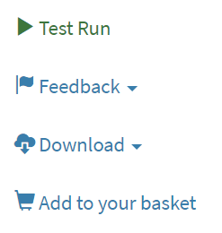
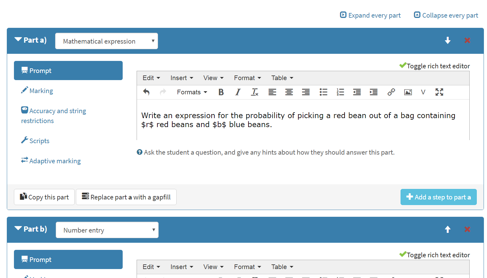

Questions
*********

In Numbas, a *question* is a self-contained assessment of a particular scenario. 
Every Numbas question consists of three sections: :ref:`Statement <statement>`, :ref:`Parts <parts>`, and :ref:`Advice <advice>`.

* In the **Statement**, the context for the question is given to the student. 
* **Parts** are where the student enters their answers. 
  A question can have one or more parts, each of which is one of several types, depending on what kind of input you want from the student. 
* Finally, the optional **Advice** section can be used to give a full solution to the question, which the student can request to see if they're stuck, or once they've finished the exam.

The content in each section is generated each time the question is run, based on the question's :ref:`variables <variables>`.

Creating a question
====================

To create a question from any page in the Numbas editor, click on the plus icon at the top of the page, and select :guilabel:`Question`. 

.. image:: images/create_question.png

You must give a name for your question, and select a :doc:`project </project/reference>` for it to go in. 
The default project is your personal workspace; you can always move the question to another of your projects later on.

The question editor
===================

At the top of the question editor is the question's name, as well as a stamp showing the status of the question.

.. _question-stamps:

Click on the status stamp to give feedback about the quality of an question, after test running it. 
The options are listed in descending order of "suitability for use":

* **Ready to use** - this question is of sufficient quality to give to students.
* **Should not be used** - this question works, but you deprecate its use - for example, if it's not intended for use by students, or there's a better version elsewhere.
* **Has some problems** - this question works, but has some problems which mean it's not ready for use by students - for example, the question is incomplete, or changes need to be made to the text. 
  Further work is needed before this question can be given to students.
* **Doesn't work** - this question doesn't even run!
* **Needs to be tested** - this question looks alright to me, but it should be checked thoroughly before being used.

On the left of the screen are :ref:`question-admin-controls` and labels for each of the editing tabs.

.. _question-admin-controls:

Admin controls
==============

.. glossary::

    Test Run
        Opens a preview of the question in a new window. 
        A specially simplified theme will be used, different from the one used for exams.

        You can also use the keyboard shortcut :kbd:`Ctrl+B` to open a preview.

        .. warning:: 
            Do **NOT** use this link to deliver the question to students. 
            This link is not permanent and could stop working at any time.
            Instead, download the question and put it either on your own webspace or in a VLE.

    Make a copy
        Create a copy of the question. 
        Use this to make changes to an question which does not belong to you.

    Delete
        Delete the question permanently from the database. 

    Download
        Links to download standalone packages of the question. 

        * **standalone .zip** - a compiled package of the question, ready to run anywhere without connecting to a VLE. 
        * **SCORM package** - a compiled package of the question with SCORM files included, so it can be uploaded to a VLE and communicate with its gradebook.
        * **source** - a plain-text representation of the question, to be used with the Numbas command-line tools.

    Add to your basket
        Add this question to your basket, so you can include it in an exam.

.. _content-areas:

Content areas
=============

Each portion of text displayed to the student (for example, the statement, advice, and part prompts) is a *content area*.  
A content area can include text, images, or more dynamic content such as videos and interactive diagrams.

By default, text is edited using the rich text editor. 
Click on the :guilabel:`Source code` button to edit the raw HTML code for the content area.

.. figure:: images/content_area_editor.png
    :align: center

    The rich text editor

You can write mathematical notation in content areas using LaTeX; see the section on :ref:`LaTeX notation`.

.. _substituting-into-content:

Substituting variables into content areas
-----------------------------------------

There are two modes of variable subsitution: substitution into plain text (or HTML), and substitution into mathematical expressions. 

Here's a quick summary of the different methods of substituting variables into question text, to help you choose:

+---------------------------+--------------------------+----------------------------------------------+
| I want to substitute      | Such as                  | So use                                       |
+===========================+==========================+==============================================+
| A text string             | Someone's name           | Curly braces, e.g. ``{name} is a farmer.``   |
+---------------------------+--------------------------+----------------------------------------------+
| A single number into a    | :math:`x` in             | :ref:`\\var <simplification-rules>`,         |
| LaTeX expression with     | :math:`a = x`            | e.g. ``$a = \var{x}$``                       |
| no surrounding operators  |                          |                                              |
+---------------------------+--------------------------+----------------------------------------------+
| Several numbers into a    | :math:`a`, :math:`b` and | :ref:`\\simplify <simplification-rules>`,    |
| LaTeX expression          | :math:`c` into           | e.g. ``\simplify{ {a}x^2 + {b}x + {c} }``    |
|                           | :math:`ax^2+bx+c`        |                                              |
+---------------------------+--------------------------+----------------------------------------------+

Substitution of variables into plain text is straightforward: just enclose the variable name (or any :ref:`JME` expression) in curly braces. 
For example::

    Bob the farmer has {num_animals} {animal_name}.

produces::

    Bob the farmer has 12 sheep.

when ``num_animals = 12`` and ``animal_name = "sheep"``.

The substitution of variables into a mathematical expression is more complicated: depending on context, the surrounding expression may need to be change for different values of the substituted variables. 
Numbas provides a simple system to handle substitution of variables into mathematical expressions; see the section on :ref:`simplification-rules`.

Statement
=========

The statement is a content area which appears at the top of the question, before any input boxes. 
Use the statement to set up the question and provide any information the student needs to answer it.

.. _variables:

.. _parts:

Parts
=====

Each question has one or more parts.
The student is given a separate score for each part of the question, and their total score is the sum of their scores for each part.

In the editor, parts are displayed in a list; you can click on the title bar of a part to hide it, making room for the others.
Use the :guilabel:`Expand every part` and :guilabel:`Collapse every part` buttons to show or hide every part at once.

The **type** of a part defines how it appears to the student, and how it is marked.
Different part types offer different settings fields to configure the display and marking of the part.

Generic part properties
-----------------------

The following properties are available on every type of part.

.. glossary::
    Prompt
        A content area used to prompt the student for an answer.

    Marks
        The number of marks to award for answering the part correctly.

    Steps
        An optional list of sub-parts which the student can reveal by clicking on a button. 
        Marks awarded for steps don't increase the total available for the part, but are given in case the student gets a lower score for the main part.

    Penalty for revealing steps
        If the student reveals the Steps, reduce the total available marks by this amount. 
        Credit for the part is scaled down accordingly. 
        For example, if there are 6 marks available and the penalty for revealing steps is 2 marks, the total available after revealing steps is 4. 
        An answer worth 3 marks without revealing steps is instead worth :math:`3 \times \frac{4}{6} = 2` marks after revealing steps.

    Show correct answer on reveal?
        When the student reveals answers to the question, or views the question in review mode, should a correct answer be shown? You might want to turn this off if you're doing custom marking and the part has no "correct" answer.

    Show score feedback icon?
        After the student submits an answer to this part, should an icon describing their score be shown?
        This is usually shown next to the input field, as well as in the feedback box.
        You might want to turn this off if you've set up a question with a custom marking script which assigns a score based on the answers to two or more parts (or gapfills), meaning the individual parts have no independent "correct" or "incorrect" state.

.. _part-types:

Part types
----------

The following part types are built-in to Numbas:

.. toctree::
    :maxdepth: 1

    parts/mathematical-expression
    parts/numberentry
    parts/matrixentry
    parts/match-text-pattern
    parts/multiple-choice
    parts/gapfill
    parts/information
    parts/extension

:ref:`Custom part types <custom-part-types>` defined by you or other Numbas users provide extra functionality.
When editing a question, only custom part types you've made yourself or selected from the list of public part types are available.

.. _part-scripts:

Scripts
-------

The script fields allow you to override the built-in algorithms used by Numbas. 
They take JavaScript code; `the Numbas JavaScript API documentation for parts <http://numbas.github.io/Numbas/Numbas.parts.Part.html>`_ is a useful reference.

Scripts have access to the global ``Numbas`` object, as well as the following variables:

.. attribute:: part

    The current part

.. attribute:: question

    The part's parent question

.. attribute:: variables

    The question's variables, unwrapped to JavaScript objects (so numbers can be used as JavaScript numbers, instead of having to go through the JME system)

The following scripts can be customised:

.. glossary::

    When the part is created
        This function runs when the part is created (either at the start of the exam, or when the question is regenerated), after the built-in constructor for the part. 
        You could use this to change any of the part's settings, if it's not convenient to do so by other means.

    Mark student's answer
        This function runs when the student clicks the :guilabel:`Submit part` button. 
        It should establish what proportion of the available credit to award to the student for their answer, and give feedback messages. 
        Use ``this.setCredit(credit,message)`` to set the credit and (optionally) give a message. 
        Note that ``this.answered`` should be set to true if the student's answer can be marked - otherwise, the student will be shown a warning message.

    Validate student's answer
        This functions runs after the marking function, and should return ``true`` if the student's answer is in a form that can be marked, or ``false`` otherwise. 
        If the answer can't be marked, you should use ``this.giveWarning(message)`` to tell the student what's wrong.

There are several example questions using custom scripts at `numbas.mathcentre.ac.uk/exam/1016/custom-marking/ <https://numbas.mathcentre.ac.uk/exam/1016/custom-marking/>`_.

.. _adaptive-marking:

Adaptive marking
----------------

Adaptive marking allows you to incorporate the student's answers to earlier parts when marking their answer to another part.
You could use this to allow an "error carried forward" marking scheme, or in more free-form questions where one part has no correct answer - for example, "think of a number and find its square root".
This is achieved by replacing the values of question variables with the student's answers to other parts.
When a variable is replaced, any other variables depending on that one are recalculated using the new value.
All other variables keep their original values.

As an example, suppose part **a** of your question asks the student to calculate the mean of a set of numbers. 
The correct answer for this part is the variable ``sample_mean``.
Part **b** then asks the student to calculate a *z*-statistic based on the mean of the sample. 
The correct answer to this part is the variable ``z_statistic``, which is defined as ``(sample_mean-population_mean)/sqrt(population_variance)``.
(``population_mean`` and ``population_variance`` in this case are random numbers)

If the student makes an error in calculating the sample mean but uses the right method to find a *z*-statistic, they shouldn't be penalised in part **b**. 
We can ensure this by replacing the value of ``sample_mean`` with the student's answer to part **a** when marking part **b**.
When the student submits an answer to part **b**, the value of ``z_statistic`` will be automatically recalculated using the student's value of ``sample_mean``. 
Then, if the student correctly applies the formula, their answer will match the new value of ``z_statistic`` and they will receive full credit for the part.

.. warning::
    This feature can be very powerful, but make sure you don't introduce any new random variation in these dependent variables, or the correct answer will change each time the student submits their answer.

    The editor will try to catch these cases and show you a warning, with a list of the problematic variables. 
    Resolve this by moving the random elements to new variables.

    For example, in the following set of variables, ``b`` depends on ``a`` and also has a random element::

        a = random(1..5)
        b = a*random(1,-1)

    In a part where ``a`` is replaced with the answer to a previous part, ``b`` will be regenerated with the new value of ``a``. 
    However, each time this happens, it will be multiplied by a random value. 
    To fix this, create a new variable ``b_sign``::

        a = random(1..6)
        b_sign = random(1,-1)
        b = a*b_sign

    With this setup, ``b`` is always multiplied by the same value because ``b_sign`` does not depend on the replaced variable ``a``, so it is not regenerated when the part is submitted.

.. topic:: Variable replacements

    .. glossary::

        Variable
            The name of the variable to replace

        Answer to use
            The part whose answer the variable's value should be replaced with. 
            Different part types produce different types of values.

        Must be answered?
            If this is ticked, the student must submit an answer to the referenced part before they can submit an answer to this part.

    There are two variable replacement strategies:

    .. glossary::

        Try without replacements first
            The student's answer is first marked using the original values of the question variables.
            If the credit given by this method is less than the maximum available, the marking is repeated using the defined variable replacements.
            If the credit gained with variable replacements is greater than the credit gained under the original marking, that score is used, and the student is told that their answers to previous parts have been used in the marking for this part.

        Always replace variables
            The student's answer is only marked once, with the defined variable replacements applied.

    .. _part_type_variable_replacement:

.. topic:: Values obtained from the answers to each part type

    =========================== ==============
    Part type                   Value obtained
    =========================== ==============
    Gap-fill                    A list containing the values obtained from each of the gaps
    Mathematical expression     A JME subexpression. 
                                When used in a variable definition, the subexpression will be substituted in, and any references to question variables in the subexpression will be replaced with their respective values.
    Number entry                A number
    Matrix entry                A matrix
    Match text pattern          A string
    Choose one from a list      The index of the answer the student chose, starting at 0
    Choose several from a list  A list of booleans: true if the student ticked the corresponding choice, false otherwise
    Match choices with answers  A 2D list of lists of boolean values, in the same format as a :term:`custom marking matrix` for this part - cells are addressed by choice first, and answer second.
    =========================== ==============

    The following screencast shows the addition of adaptive marking to a question:

    .. todo:: Redo this screencast

    .. raw:: html

        <iframe src="https://player.vimeo.com/video/134209217" width="500" height="281" frameborder="0" webkitallowfullscreen mozallowfullscreen allowfullscreen></iframe>

.. _question-variables:

Variables
=========

.. image:: images/variable_definition.png

The :guilabel:`Generated value` column shows a generated value for each variable. 
Note that when the question is delivered to students, the variable values are generated with each new attempt, so students won't necessarily see the same values as those displayed here. 
It's a good idea to use the :guilabel:`Regenerate values` button a few times to check that randomised variables don't take unsuitable values.

You can reorder the variables in the list by dragging them. 
Doing this doesn't affect the way values are computed.

This screencast gives a quick summary of how the variable editing interface works:

.. raw:: html

    <iframe src="https://player.vimeo.com/video/167091112" width="640" height="360" frameborder="0" webkitallowfullscreen mozallowfullscreen allowfullscreen></iframe>

This screencast describes which variable names are valid, and gives some advice on how you should pick names:

.. raw:: html
    
    <iframe src="https://player.vimeo.com/video/167085662" width="640" height="360" frameborder="0" webkitallowfullscreen mozallowfullscreen allowfullscreen></iframe>

Definition
----------

.. glossary::
    Name
        The name of the variable. 
        See the :ref:`section on variable names <variable-names>`.

    Data type
        Specify what type of data the variable should hold. 
        The :guilabel:`JME code` option allows you to define the variable using :doc:`/jme-reference` syntax, while the other options provide simplified forms.

        The :guilabel:`JSON data` option allows you to enter raw `JSON <http://json.org/>`_ data, which is parsed into JME data.

    Value
        Define the variable's value. 
        The format of this field depends on the data type.

    Description
        Describe what the variable means, and how it is used. 
        It's also often helpful to explain how it's defined, and what changes can be made to it.
        
        .. note::
            Don't underestimate the value of the description field!
            Variables whose meaning seems clear when you write them have a habit of becoming indecipherable months later.

    Depends on
        A list of all variables used in this variable's definition. 
        You can click on a variable name to go to its definition.
        If the variable hasn't been defined yet, it'll be created.

    Used by
        A list of all variables which use this variable in their definition. 
        You can click on a variable name to go to its definition.

Locking variable values
-----------------------

The preview values for each question variable are regenerated each time you click on the :guilabel:`Regenerate variables` button or, if the :guilabel:`Automatically regenerate variables when changes are made` option is ticked, whenever a variable definition is changed.

You can **lock** the value of a variable so that it doesn't change when the other variables are regenerated.
To do so, click on the padlock icon next to the variable's name.
Any variables used in the definition of the locked variable (those which appear in the :guilabel:`Depends on` list) will also be locked implicitly, so that you don't end up with an inconsistent set of variables.
You can unlock a variable by clicking on the padlock icon again.

.. warning::
    Variables are only locked inside the editor's preview area - when you test run the question, or include it in an exam, a fresh value for the variable will be generated.

.. _variable-testing:

Variable testing
================

.. image:: images/variable_testing.png

This tab provides tools to test your variables for desired properties, so you can automatically re-randomise your questions' variables until you get a suitable set of values.

`Example question using variable testing tools <https://numbas.mathcentre.ac.uk/question/6789/variable-testing/>`_.

.. warning::
    While this tool allows you to pick sets of variables that would be hard to generate constructively, it's a random process so you must be aware that there's a chance no suitable set of values will ever be found. 
    Use the :guilabel:`Test condition` button to see how likely this is.

.. glossary::

    Condition to satisfy
        A JME expression which should evaluate to `true` when the set of variables generated has the properties you want. 
        For example, if `a`, `b` and `c` are the coefficients of a quadratic equation and you want it to have real roots, the condition could be `b^2-4*a*c>=0`.

        When the student runs this question, the system will regenerate the set of variables until it finds one which satisfies this condition.

    Test condition
        When you press this button, the editor will generate as many sets of variables as possible within the time given. 
        When it finishes, you'll be presented with statistics including the proportion of runs which produced acceptable sets of values, and the expected number of runs before an acceptable set of values is found.

        If the calculate probability of getting an acceptable set of variables within 1 second is lower than 99%, you should make changes to your variable definitions.

    Maximum number of runs
        The maximum number of times the system should regenerate the set of variables without finding a set which satisfies the condition before giving up. 
        If the system exceeds this number in a compiled exam, the entire exam will fail, so try to avoid it!

.. _advice:

Advice
======

:guilabel:`Advice` is a content area which is shown when the student presses the :guilabel:`Reveal` button to reveal the question's answers, or at the end of the exam.

The advice area is normally used to present a worked solution to the question.

.. _question-scripts:

Extensions & scripts
====================

This tab contains tools to change the behaviour of your question, using pre-built extensions or by adding custom JME functions and JavaScript.

Extensions
-----------

.. image:: images/extensions.png

Extensions can provide new functionality, such as extra JME functions or content types. 
To use an extension in your question, tick its checkbox here. 
All functionality provided by the extension will become available immediately.
See the section on :doc:`/extensions`.

Functions
---------

.. image:: images/functions.png

If you need to do something a bit more complicated with variables, or you find yourself repeating the same pattern over and over, you can define a custom function. 
Custom functions can be used in any JME expression in the question, such as variable definitions or part answers.

.. glossary::
    Name
        The name of the function. 
        Should be a valid JME name - it should start with a letter, and contain only letters and numbers, with no spaces or punctuation.

    Language
        Functions can be defined either with a JME expression or with JavaScript code. 
        In the case of a JME expression, the value returned is the result of evaluating the expression on the function's parameters. 
        You can also refer to the question's variables.

        JavaScript functions should return their result with a ``return`` expression. 
        You don't need to write the ``function(parameters) {}`` part - just write the function body.

    Output type
        The type of the value returned by the function. 

    Parameters
        The parameters given to the function. 
        You can refer to them by name in the function's definition. 
        Make sure you correctly set the types of the parameters. 
        You can define several functions with the same name but different parameter types, if it makes sense to do so.

JME functions
^^^^^^^^^^^^^

Functions defined using JME work similarly to variables - the function's parameters are substituted into the expression, which is then evaluated.

Comments can be added to function definitions in the same way as variable definitions - anything on a line after two forward slashes is interpreted as a comment and not evaluated. 
For example::

    map(
        log(n),    //take log of n
        n,         //for n in
        1..10      //the range 1 to 10 (inclusive)
    )

JME does not allow for much control over program flow. 
Most importantly, there are no loops. 
Some functions can naturally be defined recursively, but note that recursive function calls can be very slow, since recursion isn't optimised.

Here's an example of a function which computes the :math:`n`\ :sup:`th` Fibonacci number recursively::

    //nth fibonacci number
    //f(0) = f(1) = 1
    //f(n+2) = f(n)+f(n+1)
    if(n<=1,
        1,
    //else
        f(n-2)+f(n-1)
    )

Javascript functions
^^^^^^^^^^^^^^^^^^^^

Writing a function in Javascript allows you to use all of that language's features, such as loops, anonymous functions and DOM manipulation. 
Functions defined in Javasript don't need the ``function(parameters) { ... }`` enclosure - that's provided by Numbas - but they do need to return a value.

Numbas provides a large library of functions which you can use. 
These are accessed from the objects ``Numbas.math`` and ``Numbas.util``. 
The best way to see what's available is to look at `the Numbas code documentation <http://numbas.github.io/Numbas>`_. 
`jQuery <http://jquery.com>`_ is also available. 

While the JME system has its own type system for variables, separate from Javascript's, function parameters are unwrapped to native Javascript values on evaluation so you normally don't need to worry about it.

.. topic:: Examples

    .. highlight:: javascript

    This function takes a list of strings and returns an HTML bullet list::
        
        var ol = $('<ol>');  // create list element

        for(var i=0; i<things.length; i++) {
            ol.append($('<li>').html(things[i]));	//append list item to list
        }
          
        return ol;	//return list

    This function creates an HTML5 ``canvas`` element and draws a rectangle with the given dimensions, along with labels::

        var c = document.createElement('canvas');
        $(c).attr('width',w+40).attr('height',h+40);
        var context = c.getContext('2d');

        //fill in rectangle with a light shade
        context.fillStyle = '#eee';
        context.fillRect(5,5,w,h);

        //draw outline
        context.strokeStyle = '#000';
        context.lineWidth = 3;
        context.strokeRect(5,5,w,h);

        //draw labels
        context.fillStyle = '#000';
        context.font = '20px sans-serif';
        var wstring = w+'m';
        var tw = context.measureText(wstring).width;
        context.fillText(wstring,5+(w-tw)/2,5+h+25);

        var hstring = h+'m';
        var hw = context.measureText(hstring).width;
        context.save();
        context.translate(5+w+25,5+(h+hw)/2);
        context.rotate(-Math.PI/2);
        context.fillText(hstring,0,0);

        return c;

    You can see this function in use at https://numbas.mathcentre.ac.uk/question/759/use-canvas-to-draw-a-rectangle/.

    This function formats a number with commas to separate every third digit, i.e. :math:`1,\!000,\!000` instead of :math:`1000000`::

        var parts=n.toString().split(".");
        if(parts[1] && parts[1].length<2) {
          parts[1]+='0';
        }
        return parts[0].replace(/\B(?=(\d{3})+(?!\d))/g, ",") + (parts[1] ? "." + parts[1] : "");

    You can see this function in use at https://numbas.mathcentre.ac.uk/question/396/numerical-reasoning-average-salary/.

.. _rulesets:

Rulesets
--------

A "ruleset" defines a list of named :doc:`simplification rules </simplification>` used to manipulate mathematical expressions.

If you find yourself using the same set of rules repeatedly in ``\simplify`` commands, define a new ruleset with a shorter name to save yourself some typing.

.. _preamble:

Preamble
--------

The preambles allow you to add some code which affects the entire question. 

The code written in the :guilabel:`Javascript` preamble is executed when the question is generated, just before the question's variables are calculated. 
The Javascript preamble can access the question's properties through the `question` variable. 
You can see an example of the Javascript preamble in use at https://numbas.mathcentre.ac.uk/question/2705/jsxgraph-test-preamble-version/.

You can see what functions are available in JavaScript at `the Numbas code documentation <http://numbas.github.io/Numbas>`_.

If you want to do something with the display of the question on the page, you have to wait until its HTML has been generated, using the ``onHTMLAttached`` method. 
Here's an example which hides an element in the statement with a given id::
    
    question.onHTMLAttached(function() {
        question.display.html.find('.statement #secret').hide();
    });

The preamble also runs before the question's variables are generated; if you'd like to do something that uses the question's variables, you can either wait for ``onHTMLAttached``, or use ``question.onVariablesGenerated`` if you need to do something before the HTML is generated. 
The question's variables are stored in ``question.scope.variables`` as JME data types, or in ``question.unwrappedVariables`` as simple JavaScript data. 
Here's an example use::

    question.onVariablesGenerated(function() {
        alert("a = "+question.unwrappedVariables.a);
    });

.. warning::
    Since JME variable names are case-insensitive, all names are converted to lower case when used in JavaScript. 
    For example, a JME variable ``firstItem`` would be available in JavaScript as ``question.unwrappedVariables.firstitem``.

The CSS preamble can be used to change the look of elements in your question. 
You can see an example of the CSS preamble in use at https://numbas.mathcentre.ac.uk/question/2704/css-preamble/.

Resources
=========

You can upload any file as a :guilabel:`resource` to make it available for use elsewhere in the question. 
Uploaded files are available from the relative URL ``resources/question-resources/``. 
The URL for each resource you've uploaded is displayed next to its thumbnail.

The most common use case is to include images in content areas; see :ref:`the tutorial on including an image in a question<include-an-image>`.

Settings
========

.. glossary::
    Name
        This is shown to the student and used for searching within the editor, so make it something intelligible.
        "Find the roots of a quadratic equation" is a good name; "Alg102 q2" is not.

    Licence
        You can specify the licence under which you are making your resources available. 
        Different licences allow other users to copy, modify or reuse your content in differnet ways - consider which licence to choose carefully. 
        *CC BY* allows other users to reuse your content however you like, as long as they give appropriate credit to you.

    Description
        Use this field to describe the question's contents, what it assesses, and so on. 
        This is shown in the questions index and in the questions list of any exams containing this question, so make sure it's fairly concise.

    Tags
        Use tags to categorise questions so they can be found through the search function. 
        Your guiding principle should be "more is better" - try to write down all words that someone searching for this question might use.

        After typing a tag in the box, press the Enter key to add it to the list. 

.. _statement:

Access
======

.. image:: images/access.png

You can control who is allowed to see, and to edit, your questions.

When you create a new question, access is limited to you and any other members of the project the question belongs to.
You can grant extra access to indvidual users or *publish* your question to the public database, where it can be viewed by any other user.

.. topic:: Public visibility

    .. glossary::

        Hidden
            Only you and users named in the :guilabel:`Individual access rights` section can see this question.

        Anyone can see this
            Anyone, even users who are not logged in, can see this question. 
            Only you and users named in the :guilabel:`Individual access rights` section can edit this question.

        Anyone can edit this
            Anyone, even users who are not logged in, can see and edit this question.

.. topic:: Give access to a user

    Type a name into the search box to find a user. 
    Click on a user's name in the results list to add them to the access list. 

    Named users can have the following rights:

    .. glossary::

        Can view this
            The named user can see, but not edit, this question.

        Can edit this
            The named user can see this question and make changes to it.

.. topic:: Access Links
    
    The URLs in this section automatically grant access to whoever follows them. 
    You could use these links to share a question with someone who hasn't yet created an account on the editor, or to share a question with a group of people without inviting each person individually.

    .. warning::
        These URLs grant access to whoever clicks on them, so be careful about how they're shared.

Exams using this question
=========================

A list of links to each of the exams which contain this question, for convenience.

.. _question-other-versions:

Other versions
==============

.. image:: images/other_versions.png

In this tab you can see all questions which are related to this one. 
Questions are related if one is a copy of the other, or they are both copies of a common ancestor.
You can use this tab to compare the current question with related versions, and offer to merge your version of the question into another.

Click on the :guilabel:`Compare` link to go to a screen where you can offer to replace the other version with your version, or vice versa.
If you have editing access to the destination question, you can replace it with the other version automatically.
If you don't have editing access, the owner of the question will be sent a *Request to merge*, which they must accept before the questions are merged.

Before creating the request, you'll be asked to describe how your version differs from the one you want to replace.
Try to sum up all your changes - this will show up in the question's editing history if your request is accepted.

.. warning::
    If the question you want to replace has changed since you made a copy of it, those changes will be lost if the request to merge is accepted - the question is completely overwritten with the new version. 

    You can always restore an old version of an question after a merge, by clicking on the appropriate :guilabel:`restore` link in the :guilabel:`Editing history` tab.

Active requests to merge other versions into the current question are shown underneath the list of related versions.
You can :guilabel:`accept` the request, in which case your version will be replaced with the other version, or :guilabel:`reject` it, in which case your version will be unchanged and the person who made the request will be notified that it was rejected.

.. _question-editing-history:

Editing history
===============

.. image:: images/editing_history.png

Use this tab to keep a record of changes made to your question.
Write comments to discuss problems or suggested changes.

Each time you make a change to an question, it's saved to the database. 
To save a snapshot of the current state of the question, click the :guilabel:`Set a checkpoint` button.
You'll be asked to write a description of the question as it stands - describe what you've changed since the last snapshot, and why you're making a snapshot.

To restore a checkpoint, click its :guilabel:`Restore` button. 
The current state of the question will be overwritten with the saved state.

Other activity on this question will also be shown in this tab: for example, each time somebody uses the :guilabel:`Feedback` button to provide feedback on this question, an entry is added to the editing history.
