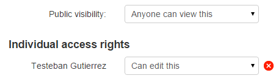
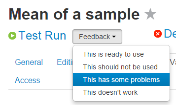
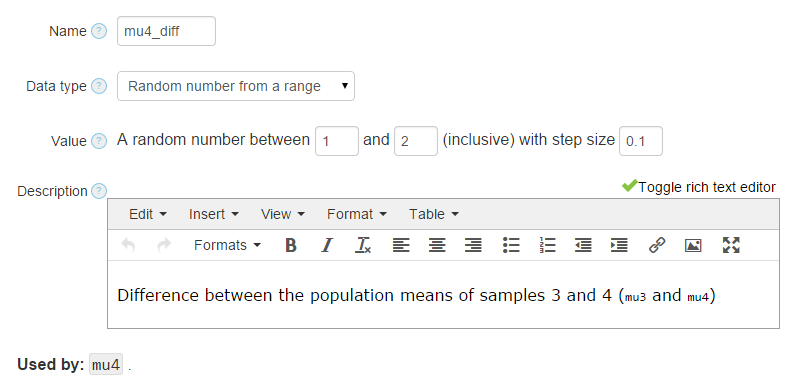

Collaborating using Numbas
==========================

Numbas has several features to make collaborating with colleagues easier. 

.. note::

    # New bits

Project
-------

Don't collaborate in your own workspace - create a separate project instead.

Projects grant automatic editing access to their members.

Timeline
--------

Use the project timeline, and the editing history tab on individual items, to keep track of changes you and your colleagues make.
Write comments to discuss changes or problems.

Restore points
--------------
Set a restore point to save a snapshot of your question when you make a change.

Write an informative description of the current state of the question, and what you've changed since the last restore point.

Give feedback
-------------

Use the feedback stamps to tell your colleagues which of your questions are ready to use, and which need more attention.

Check over your colleagues' work and use feedback stamps to alert them to problems.

When you compile an exam, every question in it should be labelled "Ready to use".

Pull requests
-------------

If you see a problem in someone else's question but don't have editing access, make a copy and fix it, but don't just leave the original to languish - create a pull request so your changes can be merged back into the original.

.. note::

    # end of new bits

Give editing access to collaborators
------------------------------------

Use the :guilabel:`Access` tab to give editing or viewing access for your questions and exams to your colleagues.

Use the editing history tab
---------------------------

.. image:: screenshots/sample_editing_history.png

Each time you make a change to a question, write a description of what you've done in the :guilabel:`Editing history` tab. This is useful when you're editing your own questions, but doubly so when editing other people's - they can quickly see what's different, and decide if they're happy with the changes.

You can write comments on the editing history. Use this to suggest changes, report bugs, and so on.

Give feedback on quality
------------------------

Use the :guilabel:`Feedback` button on questions and exams to let other users know whether they're ready for use or not.

It's a good idea to have someone else test a question once it's complete; they should proofread the text and then attempt the question, giving both correct and incorrect answers to check that the marking works as intended. 

If a colleague makes a copy of a question and you decide to use that instead, mark the original version as "Should not be used" to avoid confusion later on.

Add descriptions to variables and use sensible names
----------------------------------------------------

Short variable names are quick to type, but not easy to understand. Try to avoid single-letter variable names as much as possible, and prefer longer names over shorter ones. For example, it isn't immediately obvious what ``sm`` represents, while ``sample_mean`` is very clear.

In addition, make sure to write a description of each variable in the box under its definition. You should explain what the variable represents, and also describe any important points about how the variable is generated, or what values it can take.

Tag questions
-----------------

Use tags to categorise your questions. Agree with your colleagues how to tag questions - if everyone makes up their own tags, they're no use at all!

Here are some tagging schemes you might want to use:

* By topic - tag a question with the part of the curriculum it covers, separately from the name of the particular course you're making it for, so colleagues teaching other courses can find it.
* By level - use a tag to tell other authors which age range or ability level your question is suitable for.
