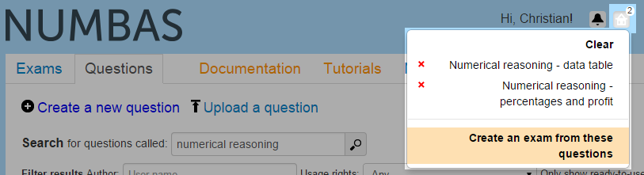
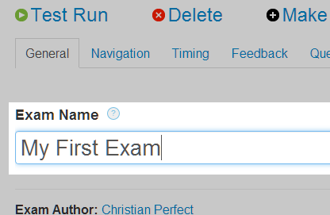
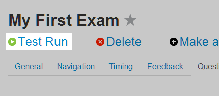
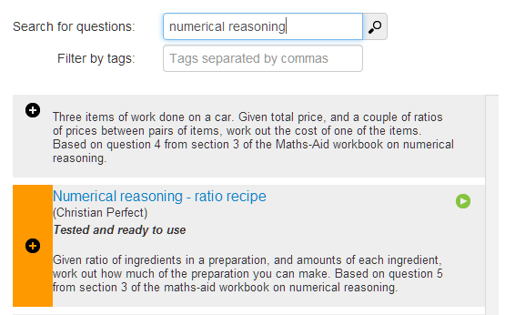
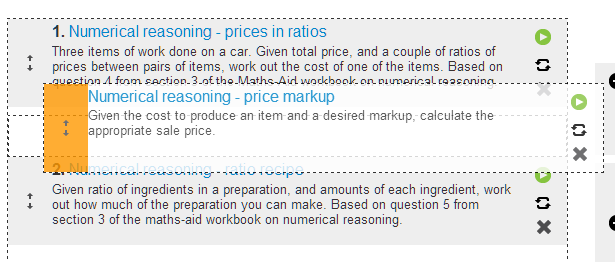

.. _create-exam:

Create an exam
--------------

Once you have :ref:`created an account on the editor <signup>`, you can create your own questions and exams, as well as look at and make copies of those made by others.

Let's create an exam using questions already in the database. 

Creating an exam using existing questions
#########################################

Click on the :guilabel:`Questions` link at the top of the page to go to the question database. 
Once there, search for a topic you're interested in.

.. image:: screenshots/question_search.png

You'll be shown a list of questions matching your query. 
Click on the green :guilabel:`Preview` icon to try out a question. 
When you've found a question you like, click on the :guilabel:`basket` icon to add it to your *question basket*. 

.. image:: screenshots/question_search_basket.png

Once you've collected a few questions, click on the :guilabel:`basket` icon at the top of the page, and then click :guilabel:`Create an exam from these questions`.
You'll be taken to the editing page for your new exam.

Enter a name in the text box. 
For now, you can ignore most of the options. 

Click the :guilabel:`Test Run` link at the top of the page. 
The compiled exam will open in a new window and you can have a go at answering the questions.

The last thing to do is to give your exam a description. 
The description should be short -- one or two lines -- and will appear underneath the exam's name in the exam listing page. 
Click on the :guilabel:`General` tab, and enter your description in the box.

Adding more questions to your exam
##################################

On the editing page for your exam, click the tab labelled :guilabel:`Questions` to go to the question selection area. 
On the left is space for your selected questions, and on the right are a few tabs offering different ways of finding questions to add.
The :guilabel:`Recent questions` tab shows questions you have recently edited.
The :guilabel:`Basket` tab shows questions you've added to your basket: you can browse the question editor to find questions, add them to your basket, and then go back to the exam editing page and add them in.
Finally, the :guilabel:`Search` tab offers a small search interface, which is useful if you know the title of the question you want to add.

You can click on any question's name to open it in a new window, so you can check the question does what you want and give it a test run before including it in your exam.

Click the plus icon on one of the question results to add it to your exam. 

You can drag and drop questions in the list on the left to reorder them.

