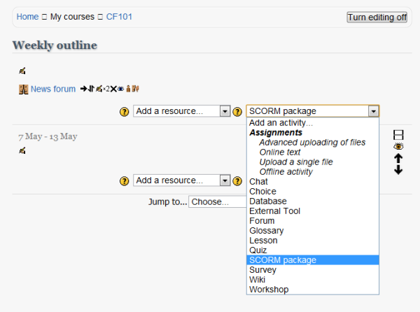
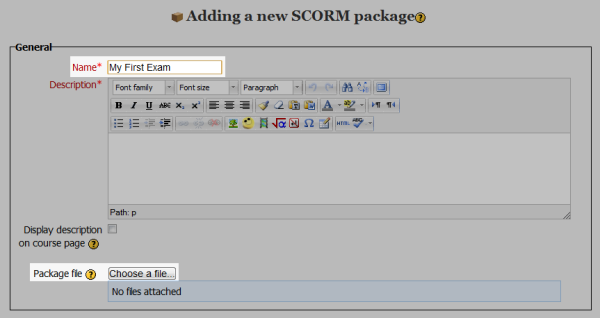

Uploading an exam to a virtual learning environment
===================================================

Numbas produces SCORM objects which can be uploaded to any SCORM 2004-compatible VLE (virtual learning environment).

This page contains instructions on uploading a Numbas exam to Blackboard and Moodle. The first step is to create a SCORM package of your exam.

Creating a SCORM package
------------------------

Each question and exam has a download link in the sidebar which, when clicked, offers a selecton of options. If you just want to make an exam available on the web and don't need to track scores, click the :guilabel:`standalone .zip (no SCORM)` link. For a version which can be uploaded to a VLE such as Blackboard or Moodle, click the :guilabel:`SCORM package` link.

.. image:: screenshots/scorm_download.png

In both cases, a .zip file containing everything needed to run the exam will be downloaded to your computer. 

Uploading to Blackboard
-----------------------

.. note::

    At least Blackboard 9.1 Service Pack 6 is required to run Numbas exams. 
    There's no way of checking your Blackboard version from within Blackboard, so check with your server admin that you're using a sufficiently recent version.

.. raw:: html

    <iframe src="https://player.vimeo.com/video/167121013" width="640" height="360" frameborder="0" webkitallowfullscreen mozallowfullscreen allowfullscreen></iframe>

Log in to Blackboard, and go to the content section of the relevant course. 
Click on the :guilabel:`Content package (SCORM)` item under the :guilabel:`Build Content` menu.

.. image:: screenshots/blackboard_content.png

On the next screen, select the .zip file you downloaded earlier, then click :guilabel:`Submit`.

.. image:: screenshots/blackboard_upload.png

On the next screen you can set some options for your exam.

.. image:: screenshots/blackboard_edit.png

The default options are usually fine, but you should make sure that the settings under :guilabel:`SCORM availability` in particular are how you want them.

.. image:: screenshots/blackboard_availability.png

Click :guilabel:`Submit`, and your exam is ready to use!

Uploading to Moodle
-------------------

.. raw:: html

    <iframe src="https://player.vimeo.com/video/167123387" width="640" height="360" frameborder="0" webkitallowfullscreen mozallowfullscreen allowfullscreen></iframe>

Log in to Moodle, and go to the relevant course. Turn editing mode on, then click on the :guilabel:`Add an activity...` dropdown and select :guilabel:`SCORM package`.

Enter your exam's name in the :guilabel:`Name` field, and write a description in the field beneath. Then click on the :guilabel:`Choose a file...` button in the :guilabel:`Package file` field and upload the .zip file you downloaded earlier.

Take a look at the rest of the settings on the page to make sure they're set how you want. The default settings are usually fine, though you might like to set :guilabel:`Hide navigation buttons` to :guilabel:`Yes` to save screen space.

When you're ready, click on :guilabel:`Save and display`. Your exam is ready to use!
