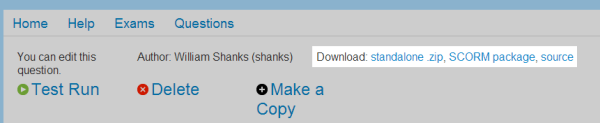

Uploading an exam to a virtual learning environment
===================================================

Numbas produces SCORM objects which can be uploaded to any SCORM 2004-compatible VLE (virtual learning environment).

This page contains instructions on uploading a Numbas exam to Blackboard and Moodle. The first step is to create a SCORM package of your exam.

Creating a SCORM package
------------------------

Each question and exam has a selection of download links at the top of its edit page. If you just want to make an exam available on the web and don't need to track scores, click the "standalone .zip" link. For a version which can be uploaded to a VLE such as Blackboard or Moodle, click the "SCORM package" link.

In both cases, a .zip file containing everything needed to run the exam will be downloaded to your computer. 

Uploading to Blackboard
-----------------------

.. note::

    At least Blackboard 9.1 Service Pack 6 is required to run Numbas exams. There's no way of checking your Blackboard version from within Blackboard, so check with your server admin that you're using a sufficiently recent version.

Log in to Blackboard, and go to the content section of the relevant course. Click on the "Content package (SCORM)" item under the "Build Content" menu.

.. image:: _static/images/screenshots/blackboard_content.png

On the next screen, select the .zip file you downloaded earlier, then click "Submit".

.. image:: _static/images/screenshots/blackboard_upload.png

On the next screen you can set some options for your exam.

.. image:: _static/images/screenshots/blackboard_edit.png

The default options are usually fine, but you should make sure the settings under "SCORM availability" in particular are how you want them.

.. image:: _static/images/screenshots/blackboard_availability.png

Click "Submit", and your exam is ready to use!

Uploading to Moodle
-------------------

Log in to Moodle, and go to the relevant course. Turn editing mode on, then click on the "Add an activity..." dropdown and select "SCORM package".

.. image:: _static/images/screenshots/moodle_content.png

Enter your exam's name in the "Name" field, and write a description in the field below. Then click on the "Choose a file..." button in the "Package file" field and upload the .zip file you downloaded earlier.

.. image:: _static/images/screenshots/moodle_upload.png

Take a look at the rest of the settings on the page to make sure they're set how you want. The default settings are usually fine, though you might like to set "Hide navigation buttons" to "Yes" to save screen space.

When you're ready, click on "Save and display". Your exam is ready to use!
