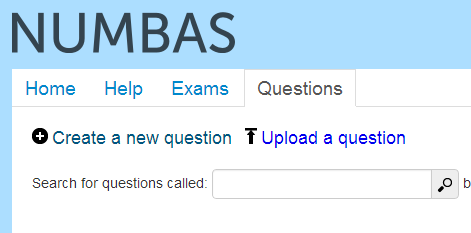
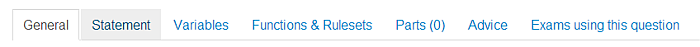
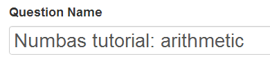
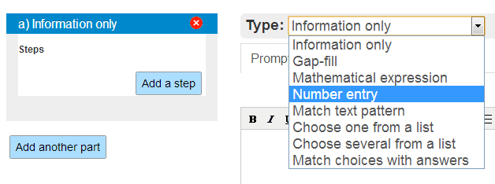
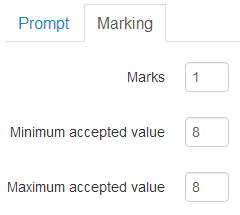
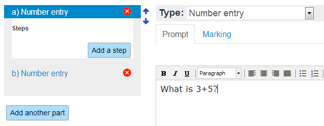
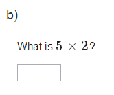
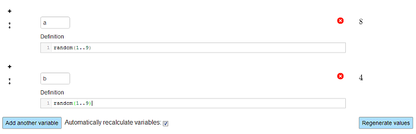

Writing your first question
===========================

.. note::
    
    The screencasts in this tutorial use an old version of the editor interface. We're going to redo them, but for now be aware that there are some differences between what you see here and what you see in the editor.

In this tutorial you will learn about the structure and features of a Numbas question by creating a simple arithmetic test, starting with basic functionality and elaborating on that as we cover the more advanced tools available.

We've embedded screencasts of someone running through this tutorial at the start of each section. You might like to follow along with the video while reading the tutorial.

To begin, let's make a question asking the student to add two numbers.

Log in to the Numbas editor, and click on the :guilabel:`Questions` heading at the top of the page. Click on :guilabel:`Create a new question`.

The structure of a question
---------------------------

.. raw:: html

    
<iframe src="http://player.vimeo.com/video/60822898" width="600" height="337" frameborder="0" webkitAllowFullScreen mozallowfullscreen allowFullScreen></iframe>

You are taken to the *editing page* for your new question. At the top of the page are the question's name and links to run, delete, copy or download the question.

.. image:: _static/images/tutorial/2.png

Beneath that is the main editing interface. The editor is split into several tabs, which you can move between by clicking on the headers.

Before moving any further, give the question a name so you can find it later. Type "Numbas tutorial: arithmetic" in the :guilabel:`Question Name` field.

Every Numbas question consists of three sections: :ref:`Statement <statement>`, :ref:`Parts <question-parts>`, and :ref:`Advice <advice>`. In the Statement, the context for the question is given to the student. Parts are where the student enters their answers. A question can have one or more parts, each of which is one of several types, depending on what kind of input you want from the student. Finally, the optional Advice section can be used to give a full solution to the question, which the student can request to see if they're stuck.

Let's make a question with a short statement, one part asking for a number to be entered, and a little bit of advice.

A very basic arithmetic question
--------------------------------

We’re going to ask the student to add together the numbers :math:`3` and :math:`5`. First, click on the :guilabel:`Statement` header, and type

    What is 3+5?

in the box.

.. image:: _static/images/tutorial/5.png

Click on the :guilabel:`Test Run` button at the top of the page. Your question will open in a new browser window. There is a statement, but nowhere to enter an answer. We need to create a number entry part. Go back to the editing window and click on :guilabel:`Parts`.

Click on the :guilabel:`Add part` button. The default part type is :ref:`Information only <information-only>`; change it to :ref:`Number entry <number-entry>` by clicking on the drop-down box.

Every part has a :term:`Prompt`, which you can use to ask the student for the particular answer the part assesses. We’ve already asked our question in the question’s statement, so we can leave this part’s prompt empty. Instead, click on the :guilabel:`Marking` tab, where you’ll state the correct answer for the part.

Enter ``1`` in the Marks field, so the student is given one mark if their answer is marked correct. *Number entry* parts are marked by checking if the student’s answer is within the range defined by the :term:`Minimum accepted value` and :term:`Maximum accepted value` fields. For this question the answer is exactly :math:`8`, so put that in both fields.

Now press :guilabel:`Test Run` again to try out the question. If you put ``8`` in the entry box and press :guilabel:`Submit part`, the answer is marked correct; any other number is marked incorrect.

To finish off this question, add a solution to the *Advice* section. There isn’t much to explain for this particular question, so just click on the :guilabel:`Advice` tab and enter

    3+5 = 8

in the box.

Now click :guilabel:`Test Run` again; if you press the :guilabel:`Reveal` button at the top of the question page, the number input is filled in with the correct answer, and the advice text you wrote is displayed at the bottom.

.. image:: _static/images/tutorial/8.png

You have created your first complete question! 

.. topic:: Things to try before moving on:

    * Enter a decimal number as the correct answer, and set the minimum and maximum accepted values to allow an error of plus or minus :math:`0.005`.
    * Look at :ref:`the documentation for the Number entry part <number-entry>` and try out the precision restrictions.

Better maths display and randomised numbers
-------------------------------------------

.. raw:: html

    
<iframe src="http://player.vimeo.com/video/60823979" width="600" height="337" frameborder="0" webkitAllowFullScreen mozallowfullscreen allowFullScreen></iframe>

Now let’s add another part to the question, asking the student to multiply two numbers.

Add another *Number entry* part to your question. Now that we have two parts, it doesn’t make sense to ask for the answer to the first part in the question statement, so remove the text from the *Statement* and put it back in the first part’s *Prompt*.

Now, for the second part’s *Prompt*, enter:

    What is 3*5?

And set the correct answer to ``15``. When you :guilabel:`Test Run` the question, you should be immediately offended by the unattractiveness of the rendering of the multiplication **3*5**. Mathematical notation is distinct from normal text and needs to be treated separately. For this reason, Numbas uses :ref:`LaTeX` to mark up mathematical notation.

.. note::
    
    While LaTeX is wonderfully expressive, it has quite a steep learning curve; if you’re not familiar with it, see :ref:`LaTeX notation`.

Replace the *Prompt* for the second part with

    What is $3 \\times 5$?

The dollar symbols delimit the LaTeX notation. Now when you :guilabel:`Test Run` the question again, you will see neatly typeset maths:

For consistency, go back and change the prompt for the first part to:

    What is $3 + 5$?

The most important feature of computer-based assessment is the ability to dynamically generate questions which are different every time they are run. In Numbas this is achieved using variables.

Let’s change the question so that the two numbers to be added are picked at random.

Click on the :guilabel:`Variables` tab. Click on the :guilabel:`Add a variable` button. Every variable needs a name and a definition. The definition is given in JME syntax.

.. note:: For information on what constitutes a valid variable name, see :ref:`Variable names <variable-names>`. For more on JME syntax, see :ref:`the JME reference <jme>`.

Call this variable ``a``, and give it the definition::

    random(1..9)

The variable will take a random whole-number value between :math:`1` and :math:`9` (inclusive).

To the right of the variable's name, a possible value for the variable is displayed. You can get a feel for what values a variable can take by pressing the :guilabel:`Regenerate values` button a few times.

Add a second variable called ``b`` and give it the same definition. 

The next step is to use these variables to define the prompts and acceptable values for both parts.

Change the prompt for the first part to

    What is $\\var{a} + \\var{b}$?

``\var{}`` is a special LaTeX command which inserts the calculated value of the given expression directly into the LaTeX. It doesn’t do anything to cancel out redundant terms or symbols - more on that later.

Now go to the :guilabel:`Marking` tab and change both accepted values to ``a+b``. 

Click :guilabel:`Test Run` to see how your changes have affected the question. You can use the :guilabel:`Try another question like this one` button to regenerate the question without having to go back to the editor.

Now your question has nicely rendered maths and uses randomised numbers.

.. topic:: Things to try before moving on:
   
    * Add two new variables ``c`` and ``d``, and change the second part to use them instead of ``a`` and ``b``.
    * Make sure that ``a`` and ``b`` don’t both take the same value by using the ``except`` operator in the definition of ``b``.
    * Add a solution for the second part to the *Advice* section.

More complicated mathematical expressions
-----------------------------------------

.. raw:: html

    
<iframe src="http://player.vimeo.com/video/60825921" width="600" height="337" frameborder="0" webkitAllowFullScreen mozallowfullscreen allowFullScreen></iframe>

Until now, you’ve only written very simple mathematical expressions, where the randomised variables could be substituted in without any changes to the surrounding symbols. Often, this isn’t the case; for such occasions, there is the ``\simplify`` command.

``\simplify`` is a special LaTeX command which takes an expression in :ref:`JME syntax <jme>`, like ``\var`` does, but rather than evaluating it to a number, tidies it up using a set of :ref:`simplification rules <simplification-rules>`. 

Let’s add another part to the question, using ``\simplify`` to present a quadratic equation with random coefficients, and ask the student to factorise it.

Add a new part and set its type to :ref:`Mathematical expression <mathematical-expression>`. 

This part will be constructed in reverse - we’ll generate the roots of the equation randomly, and use those to calculate the coefficients of the quadratic shown to the student. This way, the question is guaranteed to have a nice answer.

Add two new variables ``x0`` and ``x1``::

    x0 = random(-9..9)

    x1 = random(-9..9 except x0)

The ``except`` operator in the definition of ``x1`` ensures that it doesn’t take the same value as ``x0``, so the quadratic doesn’t have repeated roots.

.. note:: 

    It’s a good idea to add comments to your variable definitions to explain what they represent and how they’re generated. A comment starts with two forward slashes ``//`` and continues until the end of the line.

Now the *Prompt* for the part might go something like this:

    Factorise $x^2 + \\var{x0+x1}x + \\var{x0*x1}$.

But that can produce unnatural expressions, like these:

.. image:: _static/images/tutorial/12.png

.. image:: _static/images/tutorial/13.png

In the first, only a subtraction sign should be shown; in the second the x term should be omitted.

Rewrite the prompt using the ``\simplify`` command:

    Factorise $\\simplify{ x^2 + {x0+x1}*x + {x0*x1} }$

The command takes an expression in :ref:`JME` syntax. The expressions between curly braces are evaluated to numbers using the defined variables, and then the whole expression is rearranged to produce something that looks more natural.

.. note:: For more on what exactly the ``\simplify`` command does, see :ref:`Simplification rules <simplification-rules>`.

Click on the part’s :guilabel:`Marking` tab and set the :term:`Correct answer` to::

    (x+{x0})(x+{x1})

(Again, expressions in curly braces are evaluated as numbers when the question is run.)

Numbas marks *Mathematical expression* parts by choosing a random sample of points on which to evaluate them, and comparing the result given by the student’s answer with that given by the :term:`Correct answer`. Because it doesn’t pay any attention to the form of the student’s answer, it has no way of distinguishing between the factorised and expanded forms of our quadratic - the student could just enter the same expression they’re given and it would be marked correct.

To prevent this, you can specify some :ref:`string restrictions <string-restrictions>` to constrain the student’s answer. It isn’t a perfect method, but it’s usually good enough. 

Go to the part’s :guilabel:`Accuracy and string restrictions` tab and enter ``(`` and ``)`` in the :guilabel:`Required strings` field, and ``^`` in the :guilabel:`Forbidden strings` field.

Click :guilabel:`Test Run` and check that your question is marked correctly.

That’s it for this tutorial. You’ve created a very simple Numbas question asking the student to enter some numbers and a mathematical expression, with randomised parameters and neatly rendered maths. If you got lost along the way, you can compare what you’ve got with `this question we prepared earlier <https://numbas.mathcentre.ac.uk/question/670/numbas-tutorial-arithmetic/>`_.
